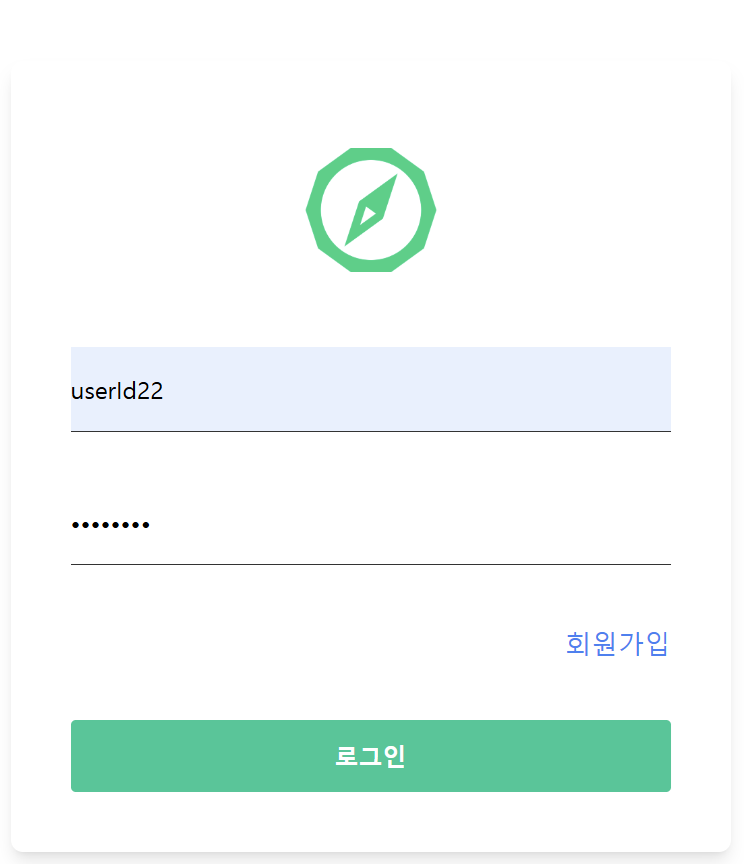
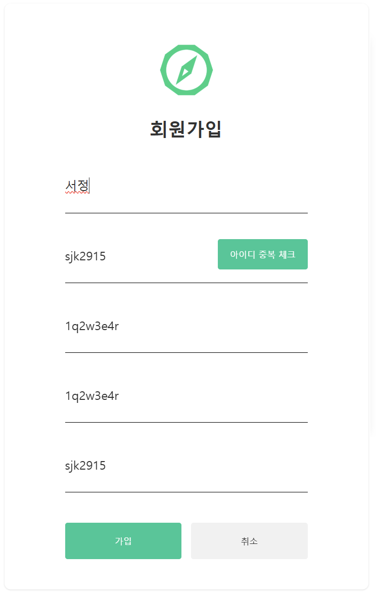
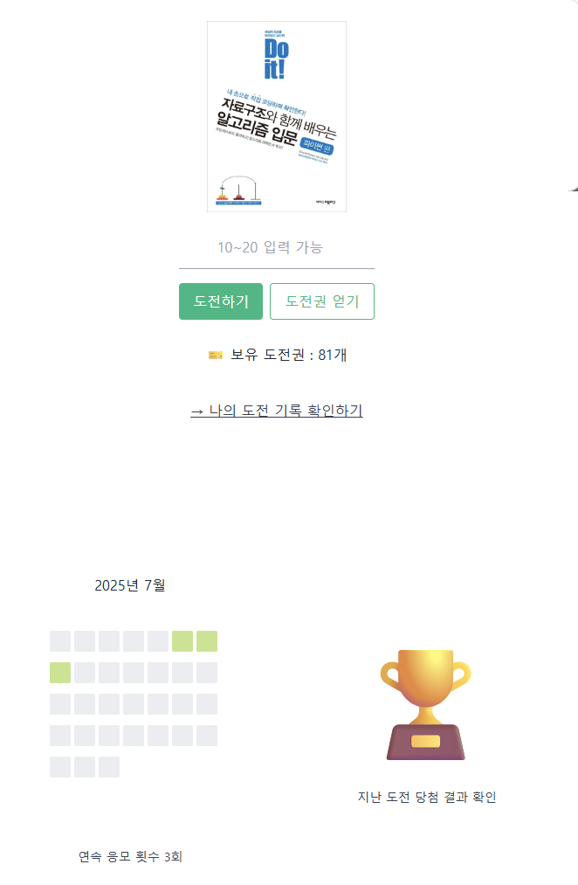
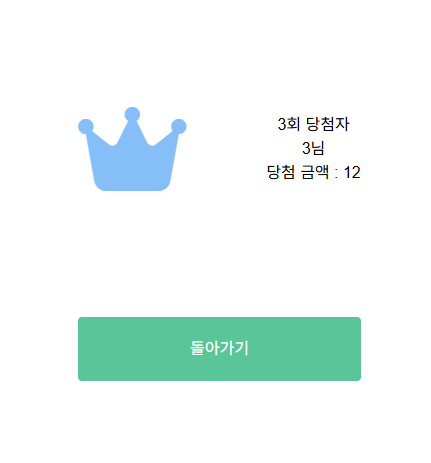
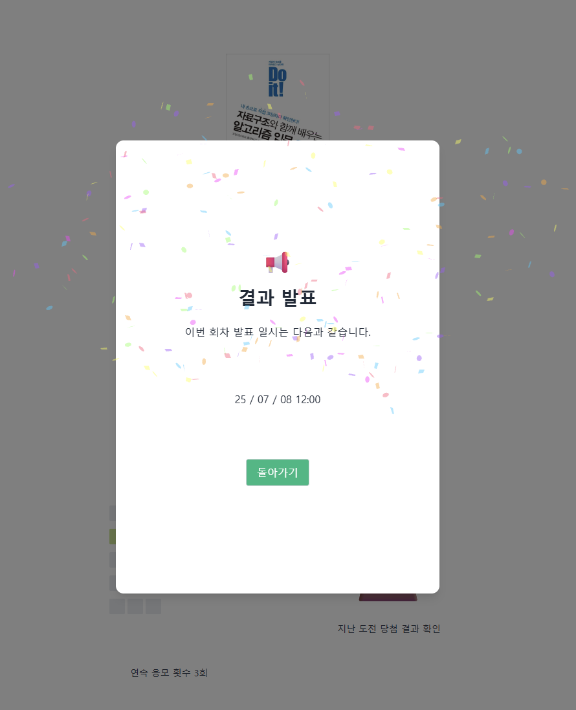
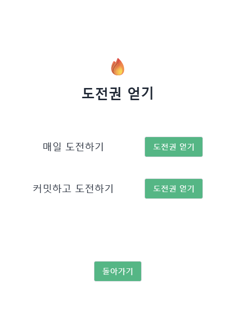
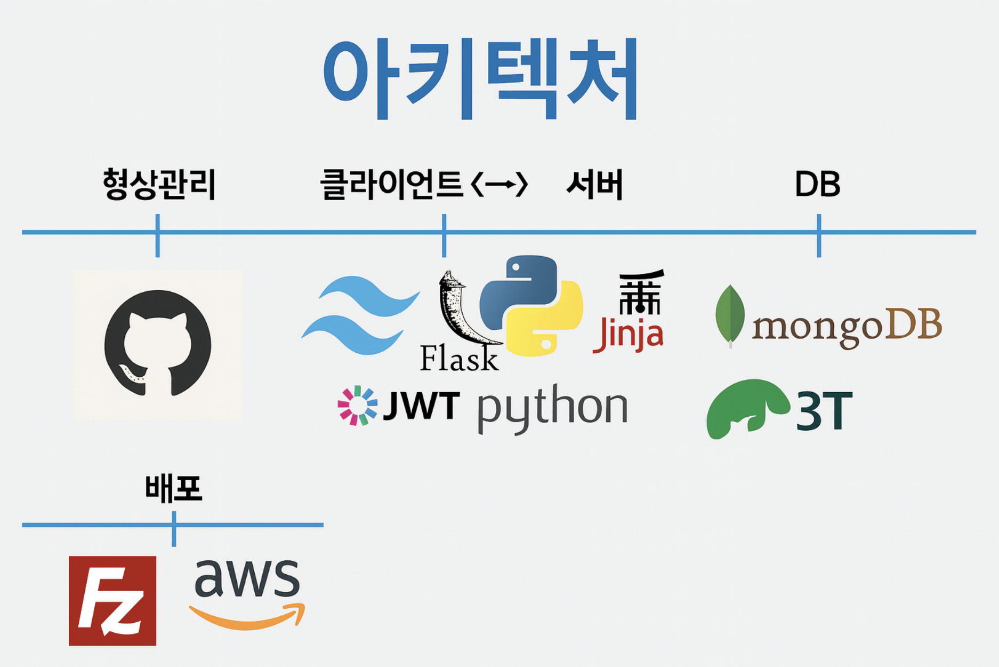

# 🎯 Lotto 말고 이거!

> “복권 대신 커밋하세요!”  
 매일 한번씩 받을 수 있고, 커밋하고 횟수로 도전권을 얻어 추첨에 도전하는 웹 서비스입니다.


## 📝 프로젝트 개요 및 기획 배경

"Lotto 말고 이거"는 정글러의 루틴 속에 소소한 재미를 더하고, 습관 형성에 도움을 주기 위한 프로젝트입니다. 매일 한 번, 사용자는 상품의 최저가를 예측하여 가장 작고 중복되지 않은 숫자를 입력하면 당첨자가 됩니다. GitHub 커밋 기반으로 응모권이 추가 지급되며, 꾸준한 개발 활동이 곧 당첨 확률을 높이는 구조입니다. 단순한 눈치 싸움 게임 같지만, 개발자의 지속적인 몰입을 유도하는 기획 의도가 담겨 있습니다. 재미와 성취, 두 마리 토끼를 잡는 정글러 맞춤형 서비스입니다.

- **주요 기능**
  - ✅ GitHub 커밋을 확인하여 도전권 획득
  - 🔥 매일 1회 무료 도전
  - 🏆 도전 기록과 당첨 결과 확인
  - 📊 Grass 형식의 커밋 시각화

## 👥 Team members
<table>
  <tr>
    <td align="center">
      <br />
      <a href="https://github.com/ayeon59"><b>장아연 jang A Yeon</b></a><br />
       💻 Front-End / Design 
    </td>
    <td align="center">
      <br />
      <a href="https://github.com/jeonchacha"><b>전세영 Jeon Se Young</b></a><br />
      🛠 Back-End / 사용자 인증 JWT토큰
    </td>
    <td align="center">
      <br />
      <a href="https://github.com/sjk2915"><b>서정 Seo Jeong</b></a><br />
       🛠 Back-End / DB, API 설계
    </td>
  </tr>
</table>


## 📸 시연 화면

[로또말고 이거.Figma 디자인 보러가기](https://www.figma.com/design/Rg4OuCr0hXHoBEg9rktZQ/jungle_game?node-id=0-1&p=f&t=XEDSnLDM3kRyTDDy-0)

### 🖥️ 주요 페이지


| **로그인** | **회원가입** |
|------------|--------------|
|  |  |

| **메인** | **랭킹** |
|----------|----------|
|  |  |

| **도전하기** | **도전권얻기** |
|------------------|------------------|
|  |  |


## 🛠️ 아키텍쳐


---

## 🧩 기술 스택

```
┌────────────────────────────────────────────────────────────────────────────┐
│                           AWS EC2 (Ubuntu) 배포 환경                         │
│                                                                            │
│ ┌────────────────────────────────────────────────────────────────────────┐ │
│ │                            FRONTEND (브라우저)                           │ │
│ │                                                                        │ │
│ │  ┌──────────┐  ┌──────────┐  ┌───────────┐  ┌────────────┐             │ │
│ │  │login.html│  │ join.html│  │ main.html │  │reward.html │             │ │
│ │  │ SSR 렌더링 │  │ SSR 렌더링 │ │ 응모 & 잔디 │  │ 당첨 내역    │              │ │
│ │  └──────────┘  └──────────┘  └───────────┘  └────────────┘             │ │
│ │     │               │               │              │                   │ │
│ │     └─────┬─────────┴─────┬─────────┴──────┬───────┘                   │ │
│ │           │ JavaScript   │ TailwindCSS     │ Jinja2 템플릿               │ │
│ └───────────┴──────────────┴─────────────────┴───────────────────────────┘ │
│                                                                            │
│ ┌────────────────────────────────────────────────────────────────────────┐ │
│ │                             BACKEND (Flask)                            │ │
│ │                                                                        │ │
│ │  ┌─────────────┐    ┌──────────────────────────────────────────────┐   │ │
│ │  │   app.py    │    │                 repository.py                │   │ │
│ │  └────┬────────┘    └──────────────────────────────────────────────┘   │ │
│ │       │ 라우트 처리: GET, POST 등                                         │ │
│ │       │ JWT 토큰 인증 / 응모 처리 / 템플릿 렌더링                              │ │
│ └───────┴────────────────────────────────────────────────────────────────┘ │
│                                                                            │
│ ┌────────────────────────────────────────────────────────────────────────┐ │
│ │                             라우트 핸들러                                 │ │
│ │                                                                        │ │
│ │  GET  /login /signup           : 로그인/회원가입 페이지 SSR 렌더링            │ │
│ │  POST /login /signup           : 로그인/회원가입 처리 (form)                │ │
│ │  GET  /checkid                  : ID 중복 확인                           │ │
│ │  POST /logout                   : 로그아웃                               │ │
│ │  GET  /main, /getreward         : 응모 및 결과 페이지 SSR                  │ │
│ │  POST /apply                    : 금액 응모 처리                          │ │
│ │  GET  /getAppList               : 응모 내역 리스트 조회                     │ │
│ │  GET  /getConsecutiveDay        : 연속 응모 일수 조회 (잔디 용)              │ │
│ │  GET  /getTicketCount           : 남은 도전권 수 조회                      │ │
│ │  GET  /getProductInfo           : 상품 정보 불러오기                       │ │
│ │  POST /ticket                   : 도전권 발급 (커밋 기반)                   │ │
│ │  POST /refresh                  : JWT 리프레시 토큰으로 access 재발급        │ │
│ └────────────────────────────────────────────────────────────────────────┘ │
│                                                                            │
│ ┌────────────────────────────────────────────────────────────────────────┐ │
│ │                              DATABASE (MongoDB)                        │ │
│ │                                                                        │ │
│ │  users Collection     │ product Collection     │ reward Collection     │ │
│ │  ─────────────────     ─────────────────────     ────────────────────  │ │
│ │  - id                 │ - productName          │ - productName         │ │
│ │  - name               │ - minPrice             │ - appPrice            │ │
│ │  - pw                 │ - maxPrice             │ - appUser             │ │
│ │  - githubAccount      │ - appStartDate         │ - rewardList[]        │ │
│ │  - appTicket          │ - appEndDate           │                       │ │
│ │  - appList[]          │ - appUsers             │                       │ │
│ │  - attendanceList[]   │                        │                       │ │
│ └────────────────────────────────────────────────────────────────────────┘ │
│                                                                            │
│ ┌────────────────────────────────────────────────────────────────────────┐ │
│ │                             인증 시스템 (JWT)                             │ │
│ │                                                                        │ │
│ │  🔐 JWT 기반 쿠키 인증                                                    │ │
│ │  - 로그인 시 access_token + refresh_token 발급 후 쿠키 저장                  │ │
│ │  - access_token 만료 시 refresh_token 통해 재발급 (/refresh)               │ │
│ │                                                                        │ │
│ │  ✅ 보안:                                                               │ │
│ │  - access_token: 10분 만료 (HttpOnly 쿠키)                                │ │
│ │  - refresh_token: 24시간 유효 / DB 저장 및 블랙리스트 검사                     │ │
│ │  - XSS → HttpOnly, CSRF → SameSite 설정                                 │ │
│ └────────────────────────────────────────────────────────────────────────┘ │


```
---


## 🖥️ 배포 환경
- **AWS EC2 (Ubuntu)** 기반


## 🌐 Front-End (Jinja2 + TailwindCSS + JS)

- SSR 기반 렌더링 (Jinja2)
- 공통 요소: `JWT 쿠키 인증`, `응모 UI`, `기록 확인`, `응답 팝업`
- TailwindCSS를 활용해 클래스 기반으로 반응형 UI를 쉽고 빠르게 구성함
- 기존 CSS 작성 방식과 달리, 유틸리티 클래스를 조합하여 즉각적인 스타일 구현이 가능해 개발 속도 향상됨

| 파일명         | 기능 설명                        |
|----------------|---------------------------------|
| login.html     | 로그인 페이지 (SSR)              |
| join.html      | 회원가입 페이지 (SSR)            |
| main.html      | 메인 응모 기능, 기록 보기 (SSR), 출석 확인하기    |
| reward.html    | 지난 회차 도전 / 당첨 결과 확인 페이지 |


### 🚀 Real-Time + JS 연동
- `main.js`: 응모 처리, 팝업 제어, confetti 효과, 잔디 시각화
- `join.js`: 회원가입 데이터 처리
- `reward.js` : 팝업 제어


### 📈 Grass & 응모 기록 로직

- 응모 기록 → `applications`에 저장
- Grass 표시 → 일자별 응모 내역 Jinja2 기반 시각화
- 연속 응모 일수 계산 (백엔드에서 계산 후 템플릿에 전달, Jinja2에서 렌더링)


## 🛠 Back-End (Flask)

- **Flask 앱 엔트리포인트**: `app.py`
- **Repository 모듈**: `repository.py`에서 DB 로직 분리
- 라우트 처리

| HTTP 메서드 | 라우트                | 설명                        |
| -------- | ------------------ | ------------------------- |
| GET      | /login             | 로그인 페이지 SSR 렌더링           |
| GET      | /join              | 회원가입 페이지 SSR 렌더링          |
| GET      | /main              | 메인 응모 페이지 SSR 렌더링         |
| GET      | /reward            |  지난 회차 결과 페이지 SSR 렌더링    |
| POST     | /login             | 로그인 처리                    |
| POST     | /join              | 회원가입 처리                   |
| POST     | /lotto             | 금액 응모 처리                  |
| GET      | /grass             | Grass용 JSON 데이터 반환     |
| GET      | /api/reward        | 당첨 내역 JSON 반환 (필요 시)      |
| POST     | /refresh           | JWT 토큰 재발급 (선택적)          |
| GET      | /checkid           | 아이디 중복 확인                 |
| POST     | /logout            | 로그아웃 처리                   |
| GET      | /getreward         | 지난 회차 당첨 결과 SSR 렌더링       |
| POST     | /apply             | 응모 처리 (금액)                |
| GET      | /getAppList        | 사용자 응모 내역 리스트             |
| GET      | /getConsecutiveDay | 잔디 그래프용 연속 응모 일수 조회    |
| GET      | /getTicketCount    | 보유 도전권 개수 조회              |
| GET      | /getProductInfo    | 이번 회차 상품 정보 조회            |
| POST     | /ticket            | 도전권 발급 (ex. 커밋 기반, 하루 1회) |


---

## 🧪 데이터베이스 (MongoDB)

| 컬렉션 이름      | 필드                                  |
|------------------|-----------------------------------------------|
| Users   Collection         | name, id, pw, githubAccount, appTicket, getappTicket, appList[], attendanceList[]       |
| Product Collection    | productName, minPrice, maxPrice, appStartDate, appEndDate,  appUsers       |
| Reward Collection      | rewardName, appPrice, appUser, appRound, rewardList[]                |

---

## 🔐 인증 (JWT 기반 쿠키)

* Access Token: 10분 만료, HttpOnly 쿠키 (XSS 방지)
* Refresh Token: 24시간 만료, 재발급용, DB에 저장

### 인증 시스템 작동 방식

* 로그인 시 `access_token`과 `refresh_token`을 발급한 뒤 쿠키에 저장
* 인증이 필요한 요청마다 쿠키의 `access_token`을 확인해 사용자 인증

### 토큰 재발급

* API: `POST /refresh`
* 설명: `refresh_token`을 사용하여 새로운 `access_token` 발급

#### 재발급 조건

* `refresh_token`이 유효할 경우:

  * DB에서 해당 토큰이 블랙리스트인지 확인
  * 블랙리스트가 아니라면 재발급
* `refresh_token`이 유효하지 않을 경우 (403 반환):
    * 사용자 재로그인 필요


---


## 📋 핵심 기능 요구사항정의서

| **요구사항** | **기능**       | **상세내용**                          | **요구데이터**            | **데이터조건**             |
| -------- | ------------ | -------------------------------------- | -------------------- | --------------------- |
| 로그인      | 로그인          | 기존 회원의 경우 아이디와 비밀번호 입력 후 로그인           | ID 및 비밀번호            | 개인 식별 가능한 아이디 및 비밀번호  |
|          | 비밀번호 찾기 및 변경 | 기존 회원의 경우 아이디를 입력 후 비밀번호를 찾거나 변경할 수 있음 | 아이디 및 이메일주소          | 개인 식별 가능한 아이디 및 이메일주소 |
| 회원가입     | 회원가입         | 신규 회원은 중복되지 않는 아이디와 비밀번호로 가입 가능        | 이름, 아이디/비밀번호, 이메일 주소 | 개인 식별 가능한 고유 데이터      |
|          | 이메일 인증       | 가입 시 이메일 인증을 통해 가입 완료                  | 이메일 주소               | 개인 식별 가능한 고유 데이터      |
| 로또       | 상품 제시        | 해당 주차 경품을 확인할 수 있음                     | 경품 이미지 및 정보          |                       |
|          | 제한 범위 표시     | 도전 가능한 금액 범위를 확인할 수 있음                 | 데이터 범위 수치            |                       |
|          | 가격 입력        | 본인이 도전할 금액을 입력                         | 도전 금액                |                       |
|          | 입력 오류 표시     | 범위를 벗어난 경우 경고문구 및 입력 제한                | 제한 금액                |                       |
|          | 나의 도전 기록 확인  | 입력한 가격 및 일시를 확인                        | -                    | -                     |
|          | 유의사항 안내      | 이벤트 관련 유의사항 제공                         | -                    | -                     |
| 입력 후     | 결과 발표 안내     | 결과 발표 일시 제공                            | -                    | -                     |
|          | 재도전 안내       | 도전권을 모두 사용한 경우 안내 제공                   | -                    | -                     |
| 도전권 얻기   | 커밋 횟수 기준     | 일정 커밋 수 이상 시 도전권 지급                    | -                    | -                     |
|          | 매일 1회        | 하루 1회 무료 도전권 지급                        | -                    | -                     |
| 당첨내역     | 지난 회차 확인     | 이전 회차의 당첨 여부 확인 가능                     | -                    | -                     |
|          | 내 도전 내역      | 내 입력값과 당첨 중복 여부 확인                     | -                    | -                     |


